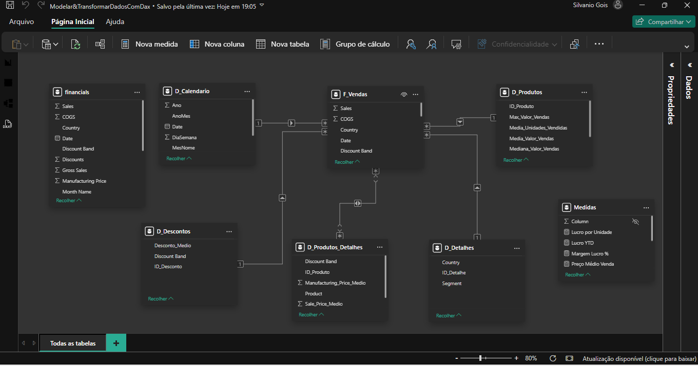

# 📊 Relatório Executivo de Vendas e Lucratividade — Power BI

> **Dashboard executivo de Business Intelligence para análise de vendas, lucratividade, margem e desempenho comercial.**

[](https://powerbi.microsoft.com/)
[](https://learn.microsoft.com/dax/)
[](https://learn.microsoft.com/power-query/)
[](https://github.com/)

---

## 🎯 Visão Geral

Este projeto apresenta a construção de um **dashboard executivo de vendas e lucratividade** utilizando o **Power BI**, desenvolvido a partir da base de dados *Financial Sample*.

O projeto vai além da criação de gráficos: os dados foram **transformados, estruturados e modelados em um Star Schema**, permitindo análises mais organizadas e eficientes sobre os principais indicadores comerciais e financeiros.

A solução foi desenvolvida com foco em:

* 📈 **Desempenho de vendas**
* 💰 **Lucratividade**
* 📊 **Margem de lucro**
* 🛒 **Volume de unidades vendidas**
* 🌎 **Desempenho por país**
* 🏢 **Análise por segmento**
* 📦 **Desempenho por produto**
* 📅 **Evolução temporal**
* 🎯 **Suporte à tomada de decisão**

---

## 🖥️ Dashboard

### Relatório Executivo


O dashboard foi projetado para proporcionar uma **visão executiva e objetiva do desempenho comercial**, permitindo identificar rapidamente tendências, oportunidades e diferenças de desempenho entre produtos, segmentos e mercados.

🔗 **[Acessar o relatório interativo no Power BI](https://app.powerbi.com/view?r=eyJrIjoiZmFjY2RlMTItNGE3NS00Mzg2LWJmM2QtMmQ3MThjOWMxNGMyIiwidCI6IjJlYmQyYzU0LWY1ZDMtNGVmYi05ZGE3LWU4Yzk0YmQyMWQzOSJ9)**

> 💡 O relatório online permite explorar os filtros e interações disponíveis no dashboard.

---

# 🧠 Arquitetura da Solução

A base original foi transformada de uma estrutura tabular para um **modelo dimensional Star Schema**, separando informações descritivas das métricas transacionais.

### Modelo de dados



### Estrutura

```text
                    ┌─────────────────┐
                    │  D_Calendario   │
                    └────────┬────────┘
                             │
                             │
┌─────────────────┐          ▼          ┌─────────────────────┐
│   D_Produtos    │ ─────► F_Vendas ◄── │     D_Detalhes     │
└─────────────────┘          ▲          └─────────────────────┘
                             │
                             │
                    ┌────────┴────────┐
                    │  D_Descontos    │
                    └─────────────────┘
```

---

## 🗂️ Modelo Dimensional

### 🔹 Tabelas Dimensão

| Tabela                  | Responsabilidade                                                                                      |
| ----------------------- | ----------------------------------------------------------------------------------------------------- |
| **D_Calendario**        | Dimensão temporal criada via DAX, contendo ano, mês, trimestre, dia e demais atributos de calendário. |
| **D_Produtos**          | Cadastro e informações agregadas relacionadas aos produtos.                                           |
| **D_Produtos_Detalhes** | Informações complementares relacionadas aos produtos e faixas de desconto.                            |
| **D_Descontos**         | Classificação das faixas de desconto e informações relacionadas ao desconto médio.                    |
| **D_Detalhes**          | Informações relacionadas a segmento e país.                                                           |

### 🔹 Tabela Fato

| Tabela       | Responsabilidade                                                                                                                                |
| ------------ | ----------------------------------------------------------------------------------------------------------------------------------------------- |
| **F_Vendas** | Armazena as principais métricas transacionais de vendas, lucro, unidades vendidas, COGS, preço de venda e respectivas chaves de relacionamento. |

### 🔗 Relacionamentos

As dimensões são relacionadas à tabela fato por meio de relacionamentos **1:N (um-para-muitos)**.

Essa estrutura favorece:

* melhor organização dos dados;
* reutilização das dimensões;
* criação de análises multidimensionais;
* maior eficiência na construção das medidas DAX;
* manutenção e evolução do modelo.

---

# 📐 Principais Medidas DAX

As principais métricas utilizadas no relatório foram:

| Medida                | DAX                                           | Objetivo                 |
| --------------------- | --------------------------------------------- | ------------------------ |
| **Total Vendas**      | `SUM(F_Vendas[Sales])`                        | Faturamento total        |
| **Total Lucro**       | `SUM(F_Vendas[Profit])`                       | Lucro total              |
| **Total Unidades**    | `SUM(F_Vendas[Units Sold])`                   | Volume total vendido     |
| **Margem Lucro %**    | `DIVIDE([Total Lucro], [Total Vendas], 0)`    | Rentabilidade das vendas |
| **Lucro YTD**         | `TOTALYTD([Total Lucro], D_Calendario[Date])` | Lucro acumulado no ano   |
| **Lucro por Unidade** | `DIVIDE([Total Lucro], [Total Unidades], 0)`  | Lucro médio por unidade  |
| **Preço Médio Venda** | `AVERAGE(F_Vendas[Sale Price])`               | Preço médio praticado    |

### 🧮 Funções DAX exploradas

Durante o desenvolvimento foram utilizadas funções como:

```text
CALENDAR()
SUM()
AVERAGE()
SUMMARIZE()
ADDCOLUMNS()
LOOKUPVALUE()
DIVIDE()
TOTALYTD()
```

Essas funções foram utilizadas para criação de dimensões, cálculos, agregações, indicadores e análises temporais.

---

# 📊 Visuais e Análises

O dashboard foi organizado em uma página executiva contendo diferentes perspectivas de análise.

### 💳 KPIs

Indicadores principais para acompanhamento imediato:

* **Total de Vendas**
* **Total de Lucro**
* **Margem de Lucro**

### 📈 Evolução Temporal

**Gráfico de linhas** para análise da evolução mensal de:

* Vendas
* Lucro

### 🏆 Ranking de Produtos

**Top 5 produtos por faturamento**, permitindo identificar os produtos de maior contribuição para a receita.

### 🏢 Análise por Segmento

**Gráfico de colunas empilhadas** para comparação das vendas entre segmentos e países.

### 🍩 Participação por Segmento

**Gráfico de rosca** apresentando a participação percentual de cada segmento nas vendas.

### 🌎 Distribuição Geográfica

**Mapa** para análise da distribuição do lucro por país.

### 🎛️ Filtros Interativos

Filtros disponíveis para exploração dos dados:

* Ano
* Segmento
* Produto

---

# 🛠️ Tecnologias Utilizadas

| Tecnologia           | Aplicação                                      |
| -------------------- | ---------------------------------------------- |
| **Power BI Desktop** | Modelagem, DAX e desenvolvimento do dashboard  |
| **Power Query**      | Extração, transformação e preparação dos dados |
| **DAX**              | Criação de medidas e cálculos analíticos       |
| **Power BI Service** | Publicação e disponibilização do relatório     |
| **Excel**            | Base de dados de origem                        |

---

# 📁 Estrutura do Repositório

```text
📦 Projeto-Power-BI
│
├── 📊 Financial Sample.xlsx
│   └── Base de dados original
│
├── 📈 Modelar&TransformarDadosComDax.pbix
│   └── Arquivo completo do Power BI
│
├── 📄 Modelar&TransformarDadosComDax.pdf
│   └── Documentação complementar
│
├── 🖼️ Modelar&TransformarDadosComDax.png
│   └── Dashboard em versão estática
│
├── 🖼️ ModelagemProjetoDIO.png
│   └── Diagrama do modelo Star Schema
│
└── 📘 README.md
    └── Documentação do projeto
```

---

# 🚀 Como Reproduzir

Para executar o projeto localmente:

### 1. Clone o repositório

```bash
git clone <URL_DO_REPOSITORIO>
```

### 2. Abra o projeto

Abra o arquivo:

```text
Modelar&TransformarDadosComDax.pbix
```

utilizando o **Power BI Desktop**.

### 3. Verifique a fonte de dados

Confirme o caminho do arquivo:

```text
Financial Sample.xlsx
```

Caso necessário, atualize a origem no **Power Query**.

### 4. Explore o modelo

No Power BI, verifique:

* tabelas;
* relacionamentos;
* cardinalidade;
* medidas DAX;
* filtros;
* hierarquia de datas.

### 5. Explore o dashboard

Utilize os filtros e interações para analisar diferentes perspectivas do negócio.

### 6. Publique no Power BI Service

Caso deseje disponibilizar o relatório online, publique o arquivo no seu workspace do Power BI Service.

---

# 💡 Principais Aprendizados

Este projeto permitiu aplicar conceitos importantes de **Business Intelligence e análise de dados**, incluindo:

### 🧱 Modelagem

* Construção de **Star Schema**;
* Separação entre tabelas fato e dimensões;
* Criação de relacionamentos;
* Estruturação de modelo dimensional.

### 🔄 ETL

* Tratamento e transformação dos dados;
* Organização das informações para análise;
* Preparação da base para consumo no Power BI.

### 🧮 DAX

* Criação de medidas;
* Agregações;
* Divisão segura com `DIVIDE()`;
* Análise temporal com `TOTALYTD()`;
* Construção de dimensões utilizando DAX.

### 📊 Data Visualization

* Construção de KPIs;
* Rankings;
* Séries temporais;
* Análises geográficas;
* Segmentação interativa;
* Visualização executiva.

### 🎯 Business Intelligence

O principal objetivo foi transformar **dados brutos em informação útil para tomada de decisão**, conectando modelagem, indicadores e visualização em uma única solução analítica.

---

# 📌 Projeto em Destaque

### O que este projeto demonstra?

> **Capacidade de transformar dados operacionais em uma solução analítica orientada à tomada de decisão.**

O projeto reúne competências de:

`Modelagem de Dados` → `ETL` → `DAX` → `Power BI` → `Data Visualization` → `Business Intelligence`

---

# 👨‍💼 Autor

## Silvanio Gois

**Gestor de Operações e Negócios | Orientado a Dados**

Atuação voltada à utilização de dados, indicadores e tecnologia para apoiar **gestão, análise de desempenho e tomada de decisão**.

🌐 **Portfólio:** [silvaniogois.com.br](https://www.silvaniogois.com.br/)

💼 **LinkedIn:** [linkedin.com/in/silvanio-gois-6667b918b](https://www.linkedin.com/in/silvanio-gois-6667b918b)

---

# 📬 Contato

Para dúvidas, sugestões, oportunidades de colaboração ou networking:

📧 **[contato@silvaniogois.com.br](mailto:contato@silvaniogois.com.br)**

🌐 [**Portfólio**](https://www.silvaniogois.com.br/)

💼 [**LinkedIn**](https://www.linkedin.com/in/silvanio-gois-6667b918b)

---

## 🏆 Projeto DIO

Este projeto foi desenvolvido como parte do desafio de **Modelagem e Transformação de Dados com DAX na DIO**, aplicando conceitos de modelagem dimensional, transformação de dados, criação de medidas e desenvolvimento de dashboards no Power BI.

---

<p align="center">
  <strong>📊 Dados → Informação → Insight → Decisão</strong>
</p>

<p align="center">
  Desenvolvido por <strong>Silvanio Gois</strong>
</p>
